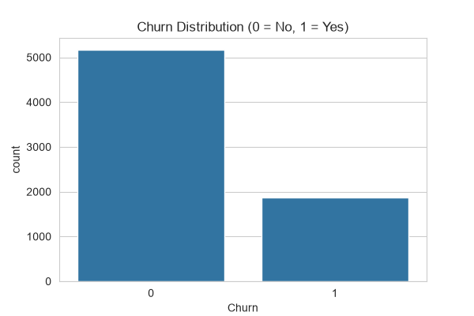
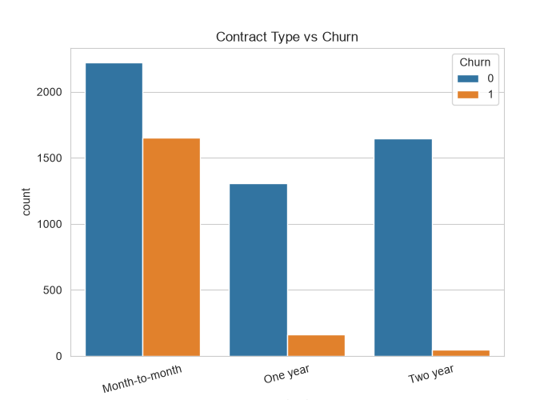
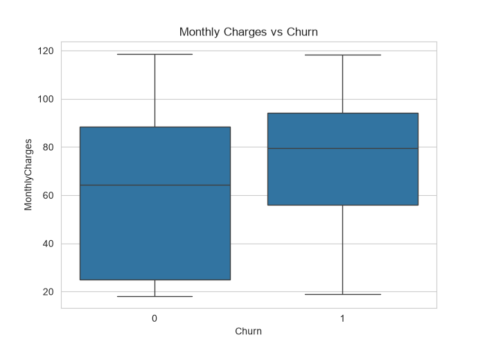
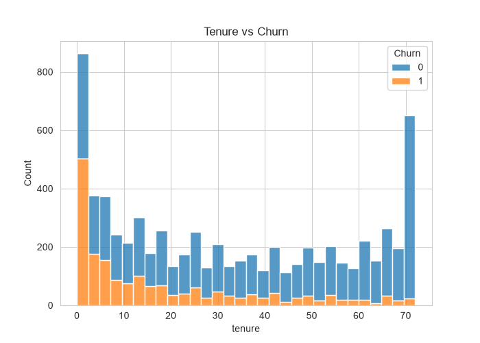

📊 Customer Churn Prediction System

An end-to-end Machine Learning project that predicts whether a telecom customer is likely to churn (leave the company) based on their account and service details. Includes data cleaning, exploratory data analysis, model training, evaluation, and an interactive web dashboard built with Streamlit.

🎯 Problem Statement

Customer churn is a major challenge for subscription-based businesses. Identifying customers who are likely to leave allows companies to take proactive retention measures. This project builds a classification model to predict churn using the Telco Customer Churn dataset.

🗂️ Dataset
Source: Telco Customer Churn Dataset (Kaggle)
Rows: 7,043 customers
Features: 20 (demographics, account info, subscribed services)
Target: Churn (Yes/No)
🛠️ Tech Stack
Tool	Purpose
Python	Core programming language
Pandas, NumPy	Data manipulation
Matplotlib, Seaborn	Data visualization
Scikit-learn	Machine learning models
Joblib	Model serialization
Streamlit	Web dashboard/UI
🔄 Project Workflow
Data Cleaning (clean_data.py) — Removed irrelevant columns, handled missing values, converted target to numeric
Exploratory Data Analysis (eda.py) — Visualized churn patterns across contract type, charges, and tenure
Feature Engineering (feature_engineering.py) — One-Hot Encoding of categorical variables
Model Training (train_model.py) — Logistic Regression baseline model
Model Evaluation (evaluate_model.py) — Precision, Recall, F1-score, Confusion Matrix
Model Comparison (compare_models.py) — Compared Logistic Regression vs Random Forest
Model Selection & Saving (save_model.py) — Selected Random Forest (better recall) and saved with Joblib
Prediction Script (predict.py) — Standalone script to test predictions on new customer data
Web App (app.py) — Interactive Streamlit dashboard for real-time predictions
📈 Model Performance
Model	Accuracy	Churn Recall
Logistic Regression	82.19%	60%
Random Forest (Final)	77.36%	81%

Random Forest was selected as the final model despite slightly lower accuracy, because it correctly identifies significantly more customers who are actually going to churn — which is more valuable for a real-world retention strategy.

📊 Exploratory Data Analysis

Churn Distribution

Contract Type vs Churn

Monthly Charges vs Churn

Tenure vs Churn

🚀 How to Run This Project

1. Clone this repository

bash
git clone https://github.com/pranav-singh30/customer-churn-prediction.git
cd customer-churn-prediction

2. Create and activate a virtual environment

bash
python -m venv venv
venv\Scripts\activate

3. Install dependencies

bash
pip install -r requirements.txt

4. Run the web app

bash
streamlit run app.py
📁 Project Structure
customer_churn_prediction/
├── churn_data.csv
├── churn_cleaned.csv
├── churn_final.csv
├── explore_data.py
├── clean_data.py
├── eda.py
├── feature_engineering.py
├── train_model.py
├── evaluate_model.py
├── compare_models.py
├── save_model.py
├── churn_model.pkl
├── model_columns.pkl
├── predict.py
├── app.py
├── requirements.txt
├── graph1_churn_distribution.png
├── graph2_contract_vs_churn.png
├── graph3_monthlycharges_vs_churn.png
├── graph4_tenure_vs_churn.png
└── README.md
🔮 Future Improvements
Hyperparameter tuning using GridSearchCV
Try additional models (XGBoost, Gradient Boosting)
Handle class imbalance with SMOTE
Deploy the app on Streamlit Cloud
👤 Author

Pranav Singh

GitHub: @pranav-singh30

Built as part of a hands-on Machine Learning learning project.